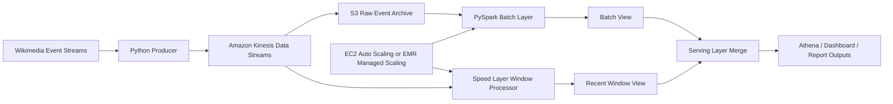

# Architecture

## Batch View

The batch layer reads all accumulated events and computes complete historical aggregates:

- top edited pages
- top languages/projects
- bot vs human edit counts
- event volume per time interval

## Speed View

The speed layer updates recent aggregates over sliding windows:

- top pages in the last 1 minute
- top pages in the last 5 minutes
- event count per language in the current window

## Serving Merge

The serving layer combines:

- accurate historical results from the batch view
- fresh recent results from the speed view

This gives both correctness and low latency, which is the purpose of the Lambda architecture.

